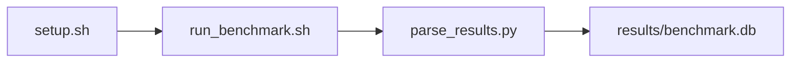

# vLLM Inference Throughput & Latency Benchmark

[](LICENSE)
[](.github/workflows/ci.yml)

Target: Ubuntu 26.04 · AMD · see Hardware Requirements. This is a host benchmark, not a laptop `pip install` project.

## Quick Start

```bash
git clone https://github.com/garys-gpu-benchmarks/328-gpu-bench-amd-vllm-throughput-latency-ubu2604.git
cd 328-gpu-bench-amd-vllm-throughput-latency-ubu2604
sudo bash setup.sh --assume-yes
bash run_benchmark.sh --profile smoke --validate
```
Results are written to `results/benchmark.db` and `results/summary.json`.

This workload is executed on the validation host after the repository is copied there. `setup.sh` and `run_benchmark.sh` do not open an outbound SSH session.

Prerequisites: Ubuntu 26.04; AMD; Python 3.14.4; root or sudo for `setup.sh`. Framework: Bash, SQLite, Python, PyYAML, ROCm Runtime, PyTorch-ROCm, Hugging Face Transformers, vLLM, Mistral-7B-v0.3. Set HF_TOKEN when the model license requires a Hugging Face token. This is a host benchmark, not a laptop `pip install` project.



## 1. Overview

Starts python -m vllm.entrypoints.openai.api_server with mistralai/Mistral-7B-v0.3 on 127.0.0.1:8000 for every profile, waits for /v1/models, runs scripts/benchmark_serving.py once, then stops the server. input_len, output_len, and concurrency come from yaml. Measures serving throughput, TTFT, TPOT, ITL, and end-to-end latency. output_format: csv Sweep dimensions: model_name, dtype, tensor_parallel_size, gpu_memory_utilization, prompt_source, input_len, output_len, max_num_seqs.

## 2. What It Validates

- Validates token throughput and request latency from concurrent completions against the real vLLM OpenAI server. Every profile starts python -m vllm.entrypoints.openai.api_server
- #1: Output token throughput (output_token_throughput_tokens_sec); is present and physically sensible.
- #2: Time To First Token, ms (ttft_p50_msec); is present and physically sensible.
- #3: Time Per Output Token, ms (time_per_output_token_tpot_p50_msec); is present and physically sensible.
- #4: Inter-token latency, ms (inter_token_latency_itl_p50_msec); is present and physically sensible.
- #5: End-to-end request latency, ms (end_to_end_request_latency_msec) is present and physically sensible.

## 3. Metrics Captured

- **#1: Output token throughput** — stored as `output_token_throughput_tokens_sec`.
- **#2: Time To First Token, ms** — stored as `ttft_p50_msec`.
- **#3: Time Per Output Token, ms** — stored as `time_per_output_token_tpot_p50_msec`.
- **#4: Inter-token latency, ms** — stored as `inter_token_latency_itl_p50_msec`.
- **#5: End-to-end request latency, ms** — stored as `end_to_end_request_latency_msec`.

## 4. Hardware Requirements

### Supported environment

- OS: Ubuntu 26.04
- GPU vendor: AMD
- Framework family: Bash, SQLite, Python, PyYAML, ROCm Runtime, PyTorch-ROCm, Hugging Face Transformers, vLLM, Mistral-7B-v0.3
- Python: Python 3.14.4

### Reference validation environment

The tables below describe the machine used to generate the reference results. They are not a requirement that every user buy that exact cloud instance.

### System

Ubuntu 26.04 / AMD / Bash, SQLite, Python, PyYAML, ROCm Runtime, PyTorch-ROCm, Hugging Face Transformers, vLLM, Mistral-7B-v0.3

### GPU

Ubuntu 26.04 / AMD / Bash, SQLite, Python, PyYAML, ROCm Runtime, PyTorch-ROCm, Hugging Face Transformers, vLLM, Mistral-7B-v0.3

## 5. Software Requirements

| Component | Version |
|---|---|
| OS | Ubuntu 26.04 |
| Kernel | kernel 7.0.0 |
| Python | Python 3.14.4 |
| ROCm | ROCm 7.14 |
| rocBLAS | rocBLAS 5.2.0 |

Starts python -m vllm.entrypoints.openai.api_server with mistralai/Mistral-7B-v0.3 on 127.0.0.1:8000 for every profile, waits for /v1/models, runs scripts/benchmark_serving.py once, then stops the server. input_len, output_len, and concurrency come from yaml. Measures serving throughput, TTFT, TPOT, ITL, and end-to-end latency.

## 6. Installation

```bash
Start python -m vllm.entrypoints.openai.api_server on port 8000, then run scripts/benchmark_serving.py
```

## 7. Running the Benchmark

```bash
Start python -m vllm.entrypoints.openai.api_server on port 8000, then run scripts/benchmark_serving.py
```

**Validating results separately:**

```bash
export BENCHMARK_PYTHON=/usr/bin/python3.13  # optional
python3 -m venv .venv
source ".venv/bin/activate"
".venv/bin/python" scripts/validate_results.py
```

## 8. Output

### `results/benchmark.db` (SQLite)

raw_results.csv with the serving summary written twice. Alias columns repeat the same p50 values under both _ms and _msec names

sample_index,status,output_token_throughput_tokens_s,tokens_per_sec,time_to_first_token_p50_ms,ttft_p50_ms,time_per_output_token_p50_ms,tpot_p50_ms,inter_token_latency_itl_p50_ms,itl_p50_ms,end_to_end_request_latency_ms,e2e_ms,output_token_throughput_tokens_sec,ttft_p50_msec,time_per_output_token_tpot_p50_msec,inter_token_latency_itl_p50_msec,end_to_end_request_latency_msec,error_message
0,ok,80,80,20,20,15,15,14,14,200,200,80,20,15,14,200,

```bash
Start python -m vllm.entrypoints.openai.api_server on port 8000, then run scripts/benchmark_serving.py
```

### `results/summary.json`

Consolidated metrics from the most recent run — suitable for CI artifact upload or dashboard ingestion.

### `results/raw/<timestamp>.txt`

raw_results.csv with the serving summary written twice. Alias columns repeat the same p50 values under both _ms and _msec names

sample_index,status,output_token_throughput_tokens_s,tokens_per_sec,time_to_first_token_p50_ms,ttft_p50_ms,time_per_output_token_p50_ms,tpot_p50_ms,inter_token_latency_itl_p50_ms,itl_p50_ms,end_to_end_request_latency_ms,e2e_ms,output_token_throughput_tokens_sec,ttft_p50_msec,time_per_output_token_tpot_p50_msec,inter_token_latency_itl_p50_msec,end_to_end_request_latency_msec,error_message
0,ok,80,80,20,20,15,15,14,14,200,200,80,20,15,14,200,

## 9. Baselines / Thresholds

Expected ranges and gates live in `config/benchmark_config.yaml` under `baselines:` or `thresholds:`. To update them, edit that file — never edit validation code directly.

## 10. Troubleshooting

**`setup.sh` missing collector**
Create cannot finish without `scripts/collect_workload.py`.

**`self_check` overlay rewritten**
Do not overwrite files listed in `results/overlay_lock.json`.

**Remote SSH drop during setup**
Reconnect and resume `bash setup.sh --assume-yes`. Do not wipe `.venv` or `.cache`.

## 11. NVIDIA H100 Coding Differences

Primary target is AMD ROCm. NVIDIA notes in this section are reference only and are not the execution path.

## Repository layout

```text
.
├── setup.sh
├── run_benchmark.sh
├── benchmark_specification.json
├── config/
├── scripts/
├── src/
├── tests/
├── docs/
├── results/
└── LICENSE
```
